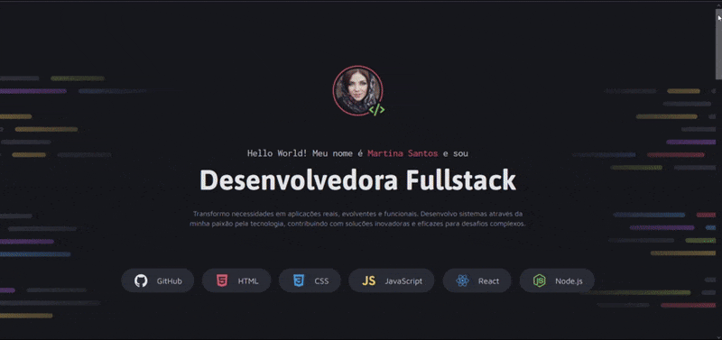

# 🗟 Projeto Portfólio Dev 🗟
Desafio prático desenvolvido durante Formação Full-Stack promovida pela Rocketseat.
___
## 🗃️ Layout direcionado para páginas de portfólio profissional

  
___
### 🤖 Tecnologias e Recursos  
  
* HTML
* CSS
* Git
* Figma
* Notion  

#### 🔎 Você pode conferir o resultado clicando [aqui](https://rakanelli.github.io/portfolioDev/) ou ver o projeto no [Figma](https://www.figma.com/community/file/1387080701963671866) feito por [Millena Martins](https://www.linkedin.com/in/millenamartins/).  
